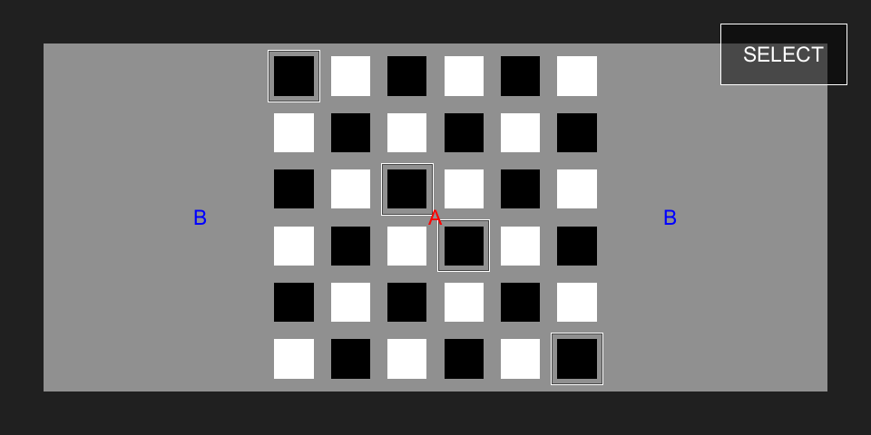

# Kōnane

> 遊戲操作

- A
  - 第一回合、第二回合選擇移除自己的棋子
  - 第三回合開始選擇自己的棋子移動
- B
  - 第三回合開始取消自己的棋子移動
  - 第三回合開始棋子移動後可以取消棋子移動結束回合
- Select
  - 第三回合開始選擇棋子移動前可以查看那些可以移動
  - 第三回合開始選擇棋子移動後可以依序選擇移動路徑 (路徑 > 2)
  - 遊戲結束後可以重新開始遊戲

> 遊戲設定

- Assets/Resources/Game Settings.json
  - customized (是否指定第一、第二回合可選擇的位置)
  - customs  (第一、第二回合可選擇的位置)
  - dimensions (棋盤大小)
