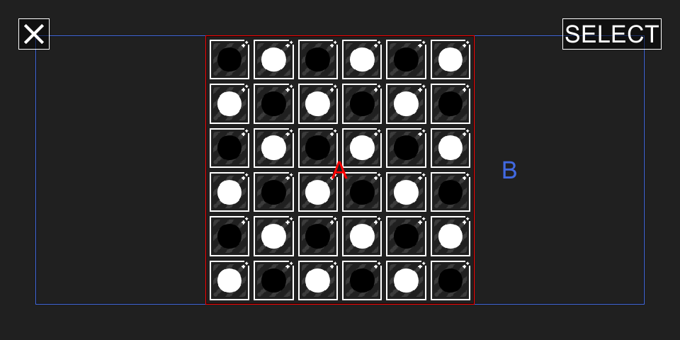

# Kōnane

> 遊戲操作

- A
  - 「拿走」黑棋/白棋
  - 「選擇」黑棋/白棋
  - 「移動」黑棋/白棋到指定的位置
- B
  - 「取消」已選擇的黑棋/白棋
  - 「結束」已移動的黑棋/白棋
- SELECT
  - 「查詢」可以移動的黑棋/白棋
  - 「選擇」黑棋/白棋的移動路徑
- X
  - 「離開」

> 遊戲設定

- Assets/Resources/*.json
  - classic (是否是經典規則)
  - customized (是否指定預設拿走的棋子位置)
  - customs (預設拿走的棋子位置)
  - dimensions (棋盤大小)
